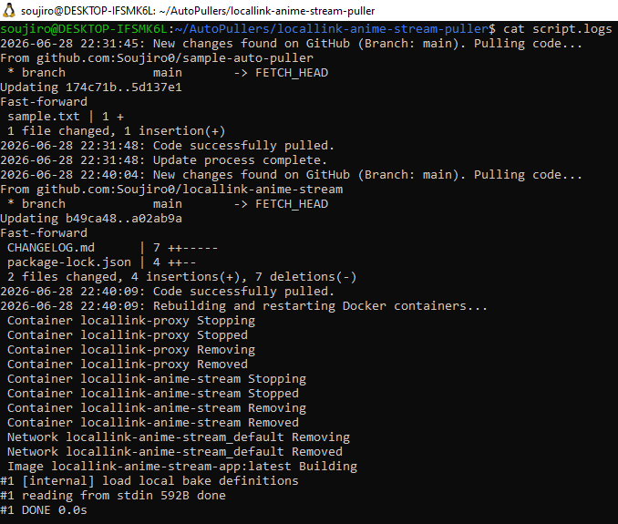
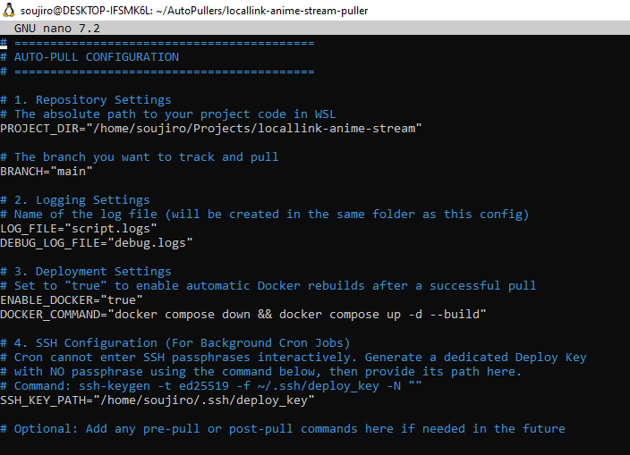
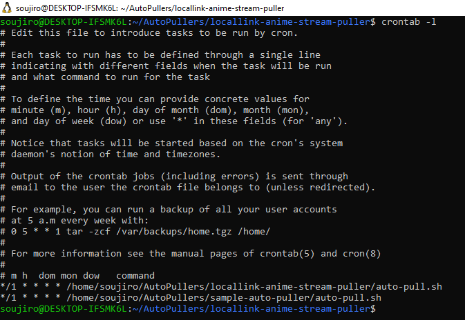
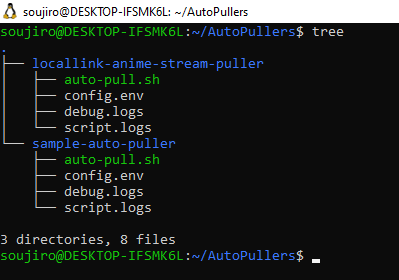

# Lightweight Bash CI/CD Pipeline 🚀

A zero-dependency, dynamic Bash scripting engine designed to automate Git deployments and Docker container rebuilds on Linux/WSL servers.

This tool serves as a lightweight alternative to Jenkins or GitHub Actions runners for local servers, automatically fetching, verifying, and pulling new code while maintaining strict security via scoped SSH Deploy Keys.

## ✨ Features

- **Zero-Dependency**: Requires only native Linux tools (Bash, Git, Cron).
- **Smart Pulling**: Fetches metadata first and compares commit hashes. It only executes a pull and triggers deployment commands if upstream changes actually exist.
- **Secure by Design**: Uses isolated, read-only SSH Deploy Keys (`IdentityFile`) instead of environment variables to prevent plaintext credential exposure in background tasks.
- **Dynamic Architecture**: Logic is separated from configuration (`config.env`). The script dynamically resolves its own path, allowing one script to manage infinite projects on the same server.
- **Docker Integration**: Optional flag to seamlessly rebuild and detach updated Docker containers (`docker compose up -d --build`) post-pull.

## 📸 Action Shots

### 1. The "Proof of Work" (Live Logs)

Proves the script actively detects changes and pulls them successfully in the background.


### 2. The Configuration File

Demonstrates a clean, dynamic architecture where variables are separated from the bash logic.


### 3. The Automation Setup

Shows the Linux system tool (Cron) configured to automate the deployment task.


### 4. The Architecture Layout

Highlights the scalable folder structure, keeping the pipeline scripts independent from the live application code.


## 🏗️ Architecture

```text
Server Root
├── Projects/                     <-- Live application source code
│   └── my_website/
└── Deployments/                  <-- Independent pipeline scripts
    └── my_website_updater/
        ├── auto-pull.sh          <-- Core logic
        ├── config.env            <-- Project-specific variables
        ├── script.logs           <-- Execution history
        └── debug.logs
```

## 🚀 Setup & Usage

1. **Clone the script** into your deployments directory.
2. **Configure environment**: Rename `config.env.example` to `config.env` and define your project path, branch, and SSH key location.
3. **Generate a passphraseless Deploy Key** for the background cron task:
   ```bash
   ssh-keygen -t ed25519 -f ~/.ssh/deploy_key -N ""
   ```
4. **Make it executable**:
   ```bash
   chmod +x auto-pull.sh
   ```
5. **Schedule with Cron** (e.g., every 1 minutes):
   ```cron
   */1 * * * * /path/to/deployments/project_updater/auto-pull.sh
   ```

## 🛠️ Tech Stack

- **Language**: Bash
- **Version Control**: Git
- **Automation**: Cron, systemd (WSL)
- **Containerization**: Docker
